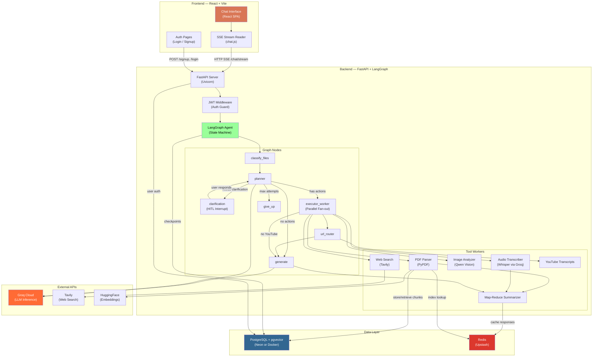
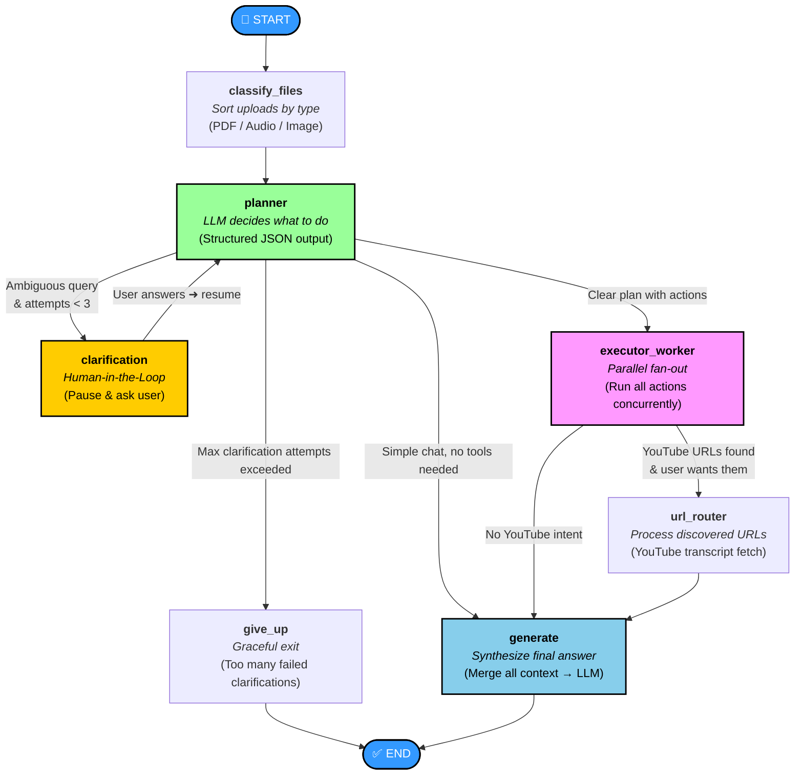

<p align="center">
  <strong>⚡ Multimodal RAG Pipeline by LangGraph</strong>
</p>

<p align="center">
  An AI-powered research assistant that reads your PDFs, listens to your audio recordings,<br/>
  sees your images, searches the web, and synthesizes everything into coherent answers —<br/>
  all through a single conversational interface.
</p>

<p align="center">
  <em>Built with LangGraph · FastAPI · React (Vite) · PostgreSQL + pgvector · Groq</em>
</p>

---

## Table of Contents

1. [What Does This Project Do?](#1-what-does-this-project-do)
2. [Key Concepts for Beginners](#2-key-concepts-for-beginners)
3. [Full System Architecture](#3-full-system-architecture)
4. [Agent Workflow — Step by Step](#4-agent-workflow--step-by-step)
5. [Project Structure](#5-project-structure)
6. [Tools & Worker Pipelines](#6-tools--worker-pipelines)
7. [Async Programming & Concurrency](#7-async-programming--concurrency)
8. [System Design & Resilience Patterns](#8-system-design--resilience-patterns)
9. [Tech Stack & Documentation Links](#9-tech-stack--documentation-links)
10. [Getting Started](#10-getting-started)
11. [Running with Docker](#11-running-with-docker)
12. [Environment Variables Reference](#12-environment-variables-reference)
13. [Research & Academic Grounding](#13-research--academic-grounding)
14. [Contributing](#14-contributing)
15. [License](#15-license)

---

## 1. What Does This Project Do?

Zeus is a **Multimodal RAG (Retrieval-Augmented Generation) Agent**. In plain English, it's a chatbot that doesn't just answer questions from its training data — it actively **reads documents you upload**, **searches the internet**, and **retrieves relevant information** before answering your question.

Here's what makes it "multimodal":

| Input Type | What Zeus Does With It |
|---|---|
| 📄 **PDF files** | Extracts full text, or performs semantic search over specific sections |
| 🎵 **Audio files** | Transcribes speech to text using Whisper, then analyzes the content |
| 🖼️ **Images** | Describes visual content using a Vision LLM (Qwen) |
| 🌐 **Web queries** | Searches the internet in real-time via the Tavily API |
| 🎬 **YouTube URLs** | Extracts and processes video transcripts found inside PDFs |

Unlike a simple chatbot, Zeus doesn't just call one model and return text. It has a **multi-step execution pipeline** — an "agentic" workflow where a planner LLM decides *what* to do, specialized workers *do* it in parallel, and a generator LLM *synthesizes* the final response.

---

## 2. Key Concepts for Beginners

If you're new to AI engineering, here are the foundational ideas this project builds on:

### What is RAG?

**Retrieval-Augmented Generation (RAG)** is a technique where, instead of relying only on a language model's pre-trained knowledge (which can be outdated or hallucinate), you first **retrieve** relevant documents from an external source and then **feed** those documents to the LLM as context. The model "reads" the retrieved content and generates an answer grounded in real data.

> **Analogy:** Imagine taking an open-book exam. You don't need to memorize every fact — you look up the relevant page in your textbook first, then write your answer based on what you just read.

### What is a State Machine?

A **state machine** (or **finite-state machine**) is a model of computation where a system can be in exactly one of a finite number of "states" at any given time. It transitions from one state to another based on conditions or inputs.

In Zeus, the conversation flow is modeled as a state machine: each "node" in the graph is a processing step (like planning, extracting PDF text, or generating the response), and the system moves between them based on what the user asked and what files they uploaded.

### What is an Embedding?

An **embedding** is a way of representing text (or images, audio, etc.) as a list of numbers — a vector in high-dimensional space. Texts with similar meanings will have vectors that are "close" to each other. This lets us do **semantic search**: instead of looking for exact keyword matches, we find content that is *conceptually* related to a query.

Zeus uses the [all-MiniLM-L6-v2](https://huggingface.co/sentence-transformers/all-MiniLM-L6-v2) model to create 384-dimensional embeddings, stored and searched using PostgreSQL's [pgvector](https://github.com/pgvector/pgvector) extension.

### What is LangGraph?

[LangGraph](https://langchain-ai.github.io/langgraph/) is a framework from the LangChain team for building **stateful, multi-step AI workflows** as directed graphs. Each "node" is a function, and "edges" define the flow between them. LangGraph adds crucial features on top of simple LLM chains:

- **State management** — a shared `TypedDict` that flows through every node
- **Conditional routing** — dynamic branching based on LLM decisions
- **Parallel execution** via `Send` — fan-out to multiple workers simultaneously
- **Interrupts** — pause execution and wait for human input (Human-in-the-Loop)
- **Persistent checkpointers** — save and resume conversations across server restarts

---

## 3. Full System Architecture

The architecture spans three layers: a **React frontend**, a **FastAPI backend**, and a **data layer** (PostgreSQL + Redis).



### How Data Flows Through the System

1. **User sends a message** → React frontend sends an HTTP request to `/api/v1/chat/stream` with the query, uploaded file paths, and a JWT token.
2. **FastAPI validates the JWT** → extracts the `user_id` and injects it into the LangGraph state.
3. **LangGraph executes the graph** → the state machine runs through nodes (classify → plan → execute → generate), streaming partial results back as Server-Sent Events (SSE).
4. **Workers fetch external data** → PDF text, audio transcripts, web search results, and image analyses are collected concurrently.
5. **Generator synthesizes a response** → all collected context is merged and passed to the LLM, which produces the final answer.
6. **Frontend renders the streamed response** → the React app receives SSE chunks and renders them incrementally in the chat interface.

---

## 4. Agent Workflow — Step by Step

The LangGraph state machine defines the exact execution path for every user message:



### Node-by-Node Breakdown

#### 1. `classify_files` — Input Sorter
> **File:** `backend/nodes/classify_route.py`

When a new message arrives, this node resets any leftover data from the previous turn (`extracted_contents` is cleared to prevent state leakage) and inspects the file extensions of uploaded files. It categorizes them into three lists:
- `pdf_files` → `.pdf`
- `audio_files` → `.mp3`, `.wav`, `.m4a`, `.ogg`, `.flac`, `.webm`
- `image_files` → `.png`, `.jpg`, `.jpeg`, `.gif`, `.bmp`, `.webp`

#### 2. `planner` — The Brain
> **File:** `backend/nodes/planner.py`

The planner is the decision-making core. It receives the user's query plus the classified file lists and asks an LLM to produce a **structured JSON plan** (a `PlannerDecision` Pydantic model) containing:

```json
{
  "task": "Summarize the uploaded research paper and search for related work",
  "required_actions": [
    { "worker": "pdf_worker", "operation": "full_document", "file_path": "..." },
    { "worker": "web_worker", "operation": "search", "query": "related work on ..." }
  ],
  "needs_clarification": false,
  "clarification_question": ""
}
```

The planner also receives **conversation history context** — both a running summary of older messages and the most recent 3 turns verbatim — so it can make contextually aware decisions.

#### 3. `clarification` — Human-in-the-Loop
> **File:** `backend/nodes/clarification.py`

If the planner decides the query is too ambiguous (e.g., "analyze this" with no file uploaded), it sets `needs_clarification: true`. The graph **interrupts** using LangGraph's `interrupt()` primitive, pausing execution and sending the clarification question back to the user. When the user responds, the graph **resumes** from the checkpoint and re-enters the planner with the new context.

A maximum of 3 clarification attempts is enforced. After that, the `give_up` node ends the conversation gracefully.

#### 4. `executor_worker` — Parallel Task Execution
> **File:** `backend/nodes/executor_worker.py`

This is where the real work happens. The `route_to_workers` function (in `fanout.py`) uses LangGraph's `Send` primitive to **spawn multiple instances** of the executor worker — one per planned action — running them **concurrently**. For example, if the planner says "read this PDF *and* search the web," both happen simultaneously.

Each worker instance processes exactly one action and returns its results into the shared `extracted_contents` state dictionary.

#### 5. `url_router` — Discovered URL Processor
> **File:** `backend/nodes/url_router.py`

After PDFs are parsed, any URLs found in the document text are collected. This node checks if any are YouTube links. If so, it calls an LLM-based **intent classifier** to determine whether the user actually wants YouTube content processed (to avoid unnecessary API calls). If the user's intent matches, YouTube transcripts are fetched and added to the extracted contents.

#### 6. `generate` — Final Answer Synthesis
> **File:** `backend/nodes/generator.py`

The generator receives *everything* — the original query, the task description, all extracted contents (PDF text, audio transcripts, image analyses, web results, YouTube transcripts), and conversation history. It merges all this context and produces the final, comprehensive answer.

If any source was pre-summarized (because it exceeded the token limit), the generator is explicitly told this so it can accurately represent the depth of its knowledge.

#### 7. `give_up` — Graceful Exit
> **File:** `backend/nodes/give_up.py`

A fallback endpoint reached when clarification attempts are exhausted. Returns a polite message explaining that the system couldn't determine the user's intent.

---

## 5. Project Structure

```
Multimodal-RAG-Pipeline-by-LangGraph/
├── backend/
│   ├── api/
│   │   ├── routes/
│   │   │   ├── auth.py          # POST /signup, /login (JWT-based)
│   │   │   ├── chat.py          # POST /chat/stream (SSE streaming)
│   │   │   └── upload.py        # POST /upload (multipart file upload)
│   │   ├── dependencies.py      # Shared request dependencies
│   │   ├── main.py              # FastAPI app setup, CORS, routers
│   │   └── schemas.py           # Pydantic request/response models
│   ├── data/
│   │   └── uploads/             # Directory for temporary uploaded files (e.g. PDFs, images, audios)
│   ├── db/
│   │   ├── cache.py             # Upstash Redis caching layer
│   │   ├── connection.py        # asyncpg connection pool management
│   │   ├── migrations.py        # Database migrations (creates tables on startup)
│   │   ├── users.py             # User authentication and database helper functions
│   │   └── vector_store.py      # pgvector chunk storage + cosine semantic search
│   ├── nodes/
│   │   ├── clarification.py     # Human-in-the-loop clarification node (interrupts/resumes graph)
│   │   ├── classify_route.py    # File classifier node (categorizes uploaded files by type)
│   │   ├── executor_worker.py   # Worker node executing planner actions in parallel
│   │   ├── fanout.py            # LangGraph dynamic parallel dispatcher (Send API)
│   │   ├── generator.py         # Final response synthesizer node
│   │   ├── give_up.py           # Graceful exit fallback node
│   │   ├── planner.py           # LLM planner node (creates step-by-step tasks)
│   │   └── url_router.py        # URL processor and YouTube intent detection node
│   ├── tools/
│   │   ├── audio_tools.py       # Whisper-based audio transcription with thread-pool chunk splitting
│   │   ├── image_tools.py       # Vision LLM (Qwen) image analyzer
│   │   ├── pdf_tools.py         # PDF parser, chunker, and semantic retriever
│   │   ├── summarizer.py        # Concurrently executed Map-Reduce summarization engine
│   │   ├── web_tools.py         # Tavily internet web search tool
│   │   └── youtube_tools.py     # YouTube transcript fetcher
│   ├── utils/
│   │   ├── auth.py              # JWT token generation, decoding and password hashing (bcrypt)
│   │   ├── history.py           # Conversation history contextualizer and summarizer
│   │   └── retry.py             # Tenacity retry logic with exponential backoff
│   ├── config.py                # Centralized environment settings (Pydantic Settings)
│   ├── graph.py                 # LangGraph StateGraph structure and compilation
│   ├── main.py                  # Entrypoint for running the backend API server
│   ├── prompts.py               # Prompts for the planner, clarifier, analyzer, and generator nodes
│   └── state.py                 # TypedDict and Pydantic models for graph State management
├── frontend/
│   ├── public/                  # Public static assets (favicon, etc.)
│   ├── src/
│   │   ├── api/                 # API clients (chat.js for SSE chat streaming, client.js for HTTP client)
│   │   ├── assets/              # React application assets (logos, images, etc.)
│   │   ├── components/          # Reusable UI components (Sidebar, MessageBubble, InputBar, etc.)
│   │   ├── context/             # React Context providers (AuthContext, ChatContext)
│   │   ├── pages/               # Route pages (Login, Signup, Chat Workspace)
│   │   ├── styles/              # Global styles and layout design tokens (index.css)
│   │   ├── App.jsx              # Application router and layout setup
│   │   └── main.jsx             # React SPA mounting script
│   ├── .env.example             # Frontend environment variables template
│   ├── .gitignore               # Frontend Git ignore configurations
│   ├── eslint.config.js         # ESLint code quality configurations
│   ├── index.html               # SPA entry point HTML structure
│   ├── package.json             # Frontend package manager configuration
│   ├── package-lock.json        # Frontend dependency lockfile
│   └── vite.config.js           # Vite development and build configuration
├── .dockerignore                # Patterns ignored by Docker build context
├── .env.example                 # Root backend environment variables template
├── .gitignore                   # Main project Git ignore configurations
├── .python-version              # Target Python version specification (e.g. 3.11.x)
├── Dockerfile                   # Docker image definition for backend api deployment
├── docker-compose.yml           # Multi-container orchestration config (Backend, Postgres)
├── deployment_strategies.md     # Guidelines and steps for production deployments
├── future_upgrades.md           # Roadmap for architectural upgrades and features
├── main.py                      # Simple script to print greeting
├── pyproject.toml               # Poetry/UV dependency requirements file
├── requirements.txt             # Exported Python pip requirements
└── uv.lock                      # UV package manager precise lockfile
```

---

## 6. Tools & Worker Pipelines

Each worker in the executor handles a specific modality:

### PDF Worker (`pdf_tools.py`)

| Operation | What It Does |
|---|---|
| `full_document` | Extracts the complete text from all pages using [PyPDF](https://pypdf.readthedocs.io/). If the text exceeds 20,000 characters, it auto-summarizes via Map-Reduce. Also extracts any URLs found in the document. |
| `retrieve` | Splits the document into chunks, computes embeddings with `all-MiniLM-L6-v2`, stores them in PostgreSQL/pgvector, and retrieves the top-k most semantically similar chunks for the user's query using cosine distance (`<=>`). |

### Audio Worker (`audio_tools.py`)

Transcribes audio files using [Whisper Large v3 Turbo](https://huggingface.co/openai/whisper-large-v3-turbo) via the Groq API. For files larger than 20 MB:
1. Splits the audio into chunks using [FFmpeg](https://ffmpeg.org/)
2. Transcribes all chunks **concurrently** using a `ThreadPoolExecutor`
3. Merges results in order

### Image Worker (`image_tools.py`)

Sends the image to a Vision LLM (Qwen 3.6-27B) via Groq, which returns a text description of the visual content — useful for analyzing figures, charts, diagrams, or photographs.

### Web Worker (`web_tools.py`)

Performs real-time web searches using the [Tavily API](https://tavily.com/), returning structured search results that the generator can cite in its response.

### YouTube Transcript Tool (`youtube_tools.py`)

Fetches video transcripts using the [youtube-transcript-api](https://pypi.org/project/youtube-transcript-api/) package. Handles multiple caption languages and auto-generated subtitles.

### Map-Reduce Summarizer (`summarizer.py`)

When any source (PDF, audio transcript, YouTube transcript) exceeds the token limit, this module:
1. **Splits** the text into chunks that fit the LLM's context window
2. **Maps** — summarizes each chunk independently (all concurrently via `asyncio.gather`)
3. **Reduces** — merges all chunk summaries into a single coherent final summary

This is a classic parallelizable NLP pattern (see [Dean & Ghemawat, 2004](https://static.googleusercontent.com/media/research.google.com/en//archive/mapreduce-osdi04.pdf)).

---

## 7. Async Programming & Concurrency

The codebase is built for high throughput. Here's how async patterns are applied throughout:

### Parallel Fan-out via LangGraph `Send`

Instead of processing planner actions one-by-one, the `route_to_workers` function creates a `Send(...)` message for each action, causing LangGraph to **spawn multiple executor_worker instances concurrently**. If the planner requests "read PDF + search web + transcribe audio," all three workers run simultaneously.

```python
# fanout.py — simplified
return [
    Send("executor_worker", {"action": action, "query": state["query"]})
    for action in actions
]
```

### Thread Offloading for Blocking I/O

FastAPI runs on an async event loop (via [Uvicorn](https://www.uvicorn.org/)). To prevent synchronous library calls from blocking the loop, they're wrapped with `asyncio.to_thread()`:

- **PDF parsing** — `PyPDFLoader` is synchronous → offloaded to a thread
- **Embedding generation** — `HuggingFaceEmbeddings.embed_documents()` → offloaded
- **Text chunking** — `RecursiveCharacterTextSplitter.split_text()` → offloaded
- **YouTube transcripts** — `YouTubeTranscriptApi` → offloaded

### Concurrent Audio Transcription

Large audio files are split into chunks and transcribed in parallel using a `ThreadPoolExecutor` with up to 4 workers. The synchronous Groq SDK calls execute across threads simultaneously.

### SSE Streaming

The `/chat/stream` endpoint uses an async generator — `async for event in graph.astream(...)` — to stream LangGraph events as [Server-Sent Events](https://developer.mozilla.org/en-US/docs/Web/API/Server-sent_events). The React frontend reads these events using the Fetch API's `ReadableStream`, rendering tokens incrementally as they arrive.

---

## 8. System Design & Resilience Patterns

### Exponential Backoff with Jitter

All LLM and external API calls are wrapped with retry logic using the [tenacity](https://tenacity.readthedocs.io/) library:

```python
# Retry up to 3 times with exponential backoff + random jitter
wait = wait_exponential(multiplier=1, min=1, max=8) + wait_random(min=0, max=1)
```

The `is_retryable()` classifier distinguishes between **transient errors** (429 rate limit, 500/502/503/504 server errors, timeouts) and **permanent errors** (400 bad request, 401 unauthorized, 404 not found). Only transient errors trigger retries.

The jitter component prevents the [thundering herd problem](https://en.wikipedia.org/wiki/Thundering_herd_problem) — where many failed requests retry at the exact same moment.

### Multi-Tiered Caching (Redis)

The application uses [Upstash Redis](https://upstash.com/) (serverless, HTTP-based) for two caching strategies:

| Cache Layer | What It Caches | TTL | Purpose |
|---|---|---|---|
| **Document Index** | Whether a file has already been chunked & embedded | 7 days | Avoids re-embedding the same PDF |
| **LLM Response** | Intermediate summaries (SHA-256 hashed prompts) | 24 hours | Avoids redundant LLM calls for identical inputs |

The document index cache follows a **write-through** pattern: after successfully inserting chunks into PostgreSQL, the cache is immediately warmed.

### Persistent Graph Checkpoints

LangGraph's `AsyncPostgresSaver` persists the entire graph state (including all messages, extracted contents, and conversation summaries) to PostgreSQL after every node execution. This means:

- **Crash recovery** — if the server restarts, users resume exactly where they left off
- **Session continuity** — conversation threads are identified by `thread_id` and survive indefinitely
- **HITL resume** — when a clarification interrupt pauses the graph, the checkpoint stores the paused state; the user can respond hours later and the graph picks up seamlessly

### Context Window Guardrails

LLMs have finite context windows. To prevent overflows:

- Any input exceeding **20,000 characters** (≈ 5,000 tokens) is automatically routed through the Map-Reduce summarizer
- A `was_summarized` flag is propagated downstream so the generator knows it's working with a condensed version, preventing it from claiming to have read the full document

### Incremental Conversation Summary

Long conversations would eventually exceed the context window. Zeus solves this with a **sliding window + incremental summary** strategy:

1. The most recent **3 turns** (6 messages) are always kept verbatim in the prompt
2. Older messages are incrementally merged into a running `conversation_summary` by a dedicated summarizer LLM
3. The summary is SHA-256 hashed and cached in Redis to avoid re-summarizing identical history states
4. Both the summary and recent turns are prepended to every planner and generator prompt

### JWT Authentication & User Isolation

- Passwords are hashed using [bcrypt](https://pypi.org/project/bcrypt/)
- Login returns a signed JWT (HS256 algorithm, 7-day expiry by default)
- Every API route validates the JWT and extracts the `user_id`
- The `user_id` is propagated through the LangGraph state, ensuring:
  - Vector store queries are scoped to the user's own documents
  - Checkpoint histories are isolated per user
  - File uploads are namespaced per user

---

## 9. Tech Stack & Documentation Links

### Backend

| Technology | Purpose | Docs |
|---|---|---|
| [FastAPI](https://fastapi.tiangolo.com/) | Async web framework for the REST API | [fastapi.tiangolo.com](https://fastapi.tiangolo.com/) |
| [Uvicorn](https://www.uvicorn.org/) | ASGI server running the FastAPI app | [uvicorn.org](https://www.uvicorn.org/) |
| [LangGraph](https://langchain-ai.github.io/langgraph/) | Stateful agent graph framework | [langchain-ai.github.io/langgraph](https://langchain-ai.github.io/langgraph/) |
| [LangChain](https://python.langchain.com/) | LLM abstractions (prompts, models, embeddings) | [python.langchain.com](https://python.langchain.com/) |
| [Groq](https://console.groq.com/docs) | Ultra-fast LLM inference (Llama, Whisper, Qwen) | [console.groq.com/docs](https://console.groq.com/docs) |
| [Pydantic](https://docs.pydantic.dev/) | Data validation, settings management, structured output | [docs.pydantic.dev](https://docs.pydantic.dev/) |
| [Tenacity](https://tenacity.readthedocs.io/) | Retry logic with backoff strategies | [tenacity.readthedocs.io](https://tenacity.readthedocs.io/) |
| [PyPDF](https://pypdf.readthedocs.io/) | PDF text extraction | [pypdf.readthedocs.io](https://pypdf.readthedocs.io/) |
| [Tavily](https://docs.tavily.com/) | Real-time web search API | [docs.tavily.com](https://docs.tavily.com/) |
| [PyJWT](https://pyjwt.readthedocs.io/) | JSON Web Token encoding/decoding | [pyjwt.readthedocs.io](https://pyjwt.readthedocs.io/) |

### Database & Caching

| Technology | Purpose | Docs |
|---|---|---|
| [PostgreSQL](https://www.postgresql.org/docs/) | Primary database (users, checkpoints, vector chunks) | [postgresql.org/docs](https://www.postgresql.org/docs/) |
| [pgvector](https://github.com/pgvector/pgvector) | Vector similarity search extension for PostgreSQL | [github.com/pgvector/pgvector](https://github.com/pgvector/pgvector) |
| [asyncpg](https://magicstack.github.io/asyncpg/) | High-performance async PostgreSQL driver | [magicstack.github.io/asyncpg](https://magicstack.github.io/asyncpg/) |
| [Upstash Redis](https://upstash.com/docs/redis) | Serverless Redis (HTTP-based, async) | [upstash.com/docs/redis](https://upstash.com/docs/redis) |

### AI Models

| Model | Purpose | Provider |
|---|---|---|
| Llama 3.3 70B / GPT-OSS 120B | Planner, Generator, Summarizer | [Groq](https://console.groq.com/) |
| GPT-OSS 20B | Intent classifier (YouTube routing) | [Groq](https://console.groq.com/) |
| Whisper Large v3 Turbo | Audio transcription | [Groq](https://console.groq.com/) |
| Qwen 3.6-27B | Vision (image analysis) | [Groq](https://console.groq.com/) |
| all-MiniLM-L6-v2 | Text embeddings (384 dimensions) | [HuggingFace](https://huggingface.co/sentence-transformers/all-MiniLM-L6-v2) |

### Frontend

| Technology | Purpose | Docs |
|---|---|---|
| [React 18+](https://react.dev/) | UI component library | [react.dev](https://react.dev/) |
| [Vite](https://vite.dev/) | Fast dev server and build tool | [vite.dev](https://vite.dev/) |
| [React Router](https://reactrouter.com/) | Client-side routing | [reactrouter.com](https://reactrouter.com/) |
| [TailwindCSS](https://tailwindcss.com/) | Utility-first CSS framework | [tailwindcss.com](https://tailwindcss.com/) |

---

## 10. Getting Started

### Prerequisites

| Tool | Version | Purpose |
|---|---|---|
| [Python](https://www.python.org/) | ≥ 3.13 | Backend runtime |
| [Node.js](https://nodejs.org/) | ≥ 18 | Frontend build |
| [uv](https://docs.astral.sh/uv/) | Latest | Python package manager (fast) |
| [FFmpeg](https://ffmpeg.org/) | Any | Audio file splitting (optional, for large audio) |

### Step 1 — Clone & Install Dependencies

```bash
# Clone the repository
git clone https://github.com/zeuspavilion/Multimodal-RAG-Pipeline-by-LangGraph.git
cd Multimodal-RAG-Pipeline-by-LangGraph

# Install Python dependencies
uv sync

# Install frontend dependencies
cd frontend
npm install
cd ..
```

### Step 2 — Set Up Environment Variables

```bash
cp .env.example .env
```

Open `.env` and fill in your API keys:

| Variable | Where to Get It |
|---|---|
| `GROQ_API_KEY` | [console.groq.com/keys](https://console.groq.com/keys) |
| `TAVILY_API_KEY` | [app.tavily.com](https://app.tavily.com/) |
| `HF_TOKEN` | [huggingface.co/settings/tokens](https://huggingface.co/settings/tokens) |
| `NEON_DATABASE_URL` | [console.neon.tech](https://console.neon.tech/) (or use Docker — see below) |
| `JWT_SECRET_KEY` | Run `openssl rand -hex 32` to generate |
| `UPSTASH_REDIS_REST_URL` | [console.upstash.com](https://console.upstash.com/) (optional) |

### Step 3 — Start the Backend

```bash
uv run uvicorn backend.api.main:app --host 127.0.0.1 --port 8000
```

On first launch, the server will:
1. Connect to PostgreSQL and run database migrations
2. Download and cache the `all-MiniLM-L6-v2` embedding model
3. Initialize the LangGraph checkpointer
4. Print `[startup] Graph compiled and ready.` when ready

### Step 4 — Start the Frontend

```bash
cd frontend
npm run dev
```

Open `http://localhost:5173` in your browser. Create an account and start chatting!

---

## 11. Running with Docker

For a fully self-contained setup (no cloud database needed):

```bash
# Build and start everything (backend + local PostgreSQL)
docker compose up --build

# Or start only the backend (using Neon cloud database)
docker compose up backend
```

The Docker setup uses `pgvector/pgvector:pg16` as the PostgreSQL image, which includes the pgvector extension pre-installed. The backend `Dockerfile` pre-downloads the `all-MiniLM-L6-v2` embedding model during build, so no internet access is needed at runtime.

---

## 12. Environment Variables Reference

| Variable | Required | Default | Description |
|---|---|---|---|
| `GROQ_API_KEY` | ✅ | — | Groq Cloud API key for LLM inference |
| `TAVILY_API_KEY` | ✅ | — | Tavily API key for web search |
| `HF_TOKEN` | ✅ | — | HuggingFace token for embedding model download |
| `NEON_DATABASE_URL` | ✅ | — | PostgreSQL connection string |
| `JWT_SECRET_KEY` | ✅ | — | Secret for signing JWT tokens |
| `JWT_ALGORITHM` | ❌ | `HS256` | JWT signing algorithm |
| `JWT_EXPIRE_MINUTES` | ❌ | `10080` (7 days) | JWT token expiry |
| `UPSTASH_REDIS_REST_URL` | ❌ | — | Redis cache URL (caching disabled if blank) |
| `UPSTASH_REDIS_REST_TOKEN` | ❌ | — | Redis cache auth token |
| `LANGCHAIN_API_KEY` | ❌ | — | LangSmith tracing key (optional) |
| `ENVIRONMENT` | ❌ | `development` | `development` or `production` |
| `CORS_ORIGINS` | ❌ | `localhost:3000,5173` | Comma-separated allowed frontend origins |

---

## 13. Research & Academic Grounding

This project draws on several established ideas from the AI and systems research literature:

### Retrieval-Augmented Generation (RAG)

> **Lewis et al., 2020.** *"Retrieval-Augmented Generation for Knowledge-Intensive NLP Tasks."*
> [arXiv:2005.11401](https://arxiv.org/abs/2005.11401)

The foundational paper that proposed combining a neural retriever with a sequence-to-sequence generator. Zeus implements this by storing document embeddings in pgvector and retrieving relevant chunks before generation.

### Dense Passage Retrieval

> **Karpukhin et al., 2020.** *"Dense Passage Retrieval for Open-Domain Question Answering."*
> [arXiv:2004.04906](https://arxiv.org/abs/2004.04906)

Zeus uses dense embeddings (from `all-MiniLM-L6-v2`) rather than sparse keyword matching (like BM25) to find relevant document passages — the approach pioneered in this paper.

### Map-Reduce for Distributed Summarization

> **Dean & Ghemawat, 2004.** *"MapReduce: Simplified Data Processing on Large Clusters."*
> [research.google.com](https://static.googleusercontent.com/media/research.google.com/en//archive/mapreduce-osdi04.pdf)

The Map-Reduce summarization pattern in `summarizer.py` is a direct application of this paradigm: chunk the input (map), summarize each chunk independently (parallel map), then merge all summaries (reduce).

### Sentence Embeddings

> **Reimers & Gurevych, 2019.** *"Sentence-BERT: Sentence Embeddings using Siamese BERT-Networks."*
> [arXiv:1908.10084](https://arxiv.org/abs/1908.10084)

The `all-MiniLM-L6-v2` model used for embeddings is from the Sentence-Transformers family, which produces semantically meaningful sentence representations optimized for cosine similarity search.

### Exponential Backoff & Jitter

> **Amazon Builders' Library.** *"Exponential Backoff and Jitter."*
> [aws.amazon.com/builders-library](https://aws.amazon.com/builders-library/timeouts-retries-and-backoff-with-jitter/)

The retry pattern implemented in `retry.py` follows Amazon's recommended approach of combining exponential backoff with random jitter to prevent correlated retry storms.

### Approximate Nearest Neighbor Search

> **Johnson, Douze, & Jégou, 2021.** *"Billion-Scale Similarity Search with GPUs."*
> [arXiv:1702.08734](https://arxiv.org/abs/1702.08734)

While Zeus currently uses exact cosine distance search via pgvector (suitable for per-user document scales), the pgvector extension supports HNSW and IVFFlat indexes for approximate nearest neighbor search at larger scales — based on the research in this and related papers.

### Whisper Speech Recognition

> **Radford et al., 2022.** *"Robust Speech Recognition via Large-Scale Weak Supervision."*
> [arXiv:2212.04356](https://arxiv.org/abs/2212.04356)

Zeus uses OpenAI's Whisper model (served via Groq) for audio transcription — a model trained on 680,000 hours of multilingual and multitask supervised data.

---

## 14. Contributing

Contributions are welcome! Please:

1. Fork the repository
2. Create a feature branch (`git checkout -b feature/your-feature`)
3. Commit your changes (`git commit -m "Add your feature"`)
4. Push to the branch (`git push origin feature/your-feature`)
5. Open a Pull Request

See [future_upgrades.md](./future_upgrades.md) for planned features and improvement areas.

---

## 15. License

This project is open source. See the [LICENSE](./LICENSE) file for details.

---

<p align="center">
  <sub>Built with ❤️ by the Zeus team</sub>
</p>
