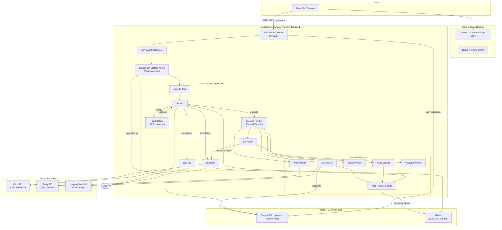
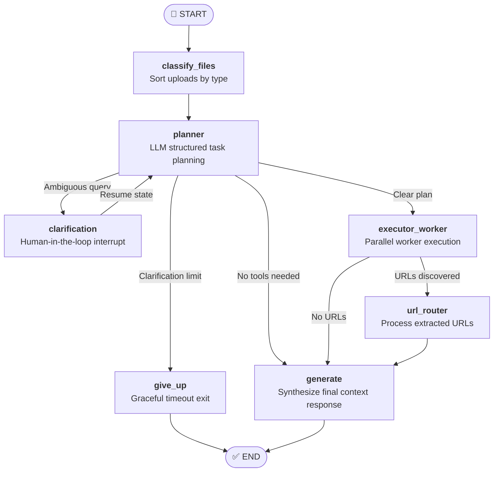

<p align="center">
  <strong>⚡ Zeus: Production-Grade Multimodal RAG Agent by LangGraph</strong>
</p>

<p align="center">
  An advanced, stateful AI research assistant that leverages LangGraph, FastAPI, and pgvector to dynamically orchestrate parallel workers for web, PDF, audio, and visual data processing under strict memory and token constraints.
</p>

<p align="center">
  <em>Built with LangGraph · FastAPI · React · PostgreSQL + pgvector · Redis · Groq</em>
</p>

---

## 1. System Capabilities

Zeus acts as a multimodal orchestrator. Rather than routing queries to a single model, it uses a dynamic planning engine to parallelize extraction and retrieval tasks:

| Target Modality | Extraction & Worker Processing Pipeline |
|---|---|
| 📄 **PDF Documents** | Local extraction using `PyPDF`, dynamic token sizing, and semantic retrieval via `pgvector`. |
| 🎵 **Audio Files** | Parallelized chunk slicing via FFmpeg, concurrent Whisper transcription via thread pool, and text formatting. |
| 🖼️ **Images & Visuals** | Content description and element extraction using Vision LLMs (Qwen 3.6-27B) over Groq. |
| 🌐 **Real-time Web** | Structured query formulation and live internet retrieval using the Tavily Search API. |
| 🎬 **YouTube Content** | Downstream intent-based transcription fetching and content summarization. |

---

## 2. Production Architecture

The stack isolates compute boundaries, separating static assets (served via CDN) from CPU-intensive application servers and data layers.



---

## 3. Stateful Graph Routing & Execution Flow

The core system flow is modeled as a directed graph using **LangGraph**. The shared state flows through a compiled state dictionary (`AgentState`).



### Core Logic Nodes

1. **`classify_files`**: Sorts and isolates incoming multipart file extensions into structured image, PDF, and audio groups, resetting states to prevent cross-session leakage.
2. **`planner`**: Prompts the LLM to output a structured JSON plan (matching the `PlannerDecision` Pydantic model) containing specific worker actions or requesting clarification.
3. **`clarification` (Human-in-the-Loop)**: Pauses execution using LangGraph's `interrupt()` primitive when details are missing (e.g. asking to search a document without providing the file). Execution resumes seamlessly once the client posts the response to the checkpointer.
4. **`executor_worker`**: Orchestrates parallel workers via LangGraph’s dynamic `Send` API. Tasks are mapped to specific worker channels and run concurrently.
5. **`url_router`**: Uses an intent classifier to determine if parsed URLs (like YouTube links) should be crawled and scraped.
6. **`generate`**: Aggregates worker outputs, summarizes text exceeding context limits, and synthesizes the final response.

---

## 4. Engineering & Concurrency Patterns

### Parallel Task Fan-out (LangGraph `Send`)
To bypass sequential API bottlenecking, tasks are dispatched in parallel. The orchestrator returns an array of `Send` channels, forcing LangGraph to spin up worker instances concurrently:
```python
# fanout.py
return [
    Send("executor_worker", {"action": action, "query": state["query"]})
    for action in actions
]
```

### Thread Offloading for Blocking I/O
FastAPI operates on an asynchronous event loop. Synchronous library operations (like file system parsing, local embedding generation, or network API wrapper calls) are offloaded to external threads to prevent blocking the event loop:
```python
# offloading execution example
document_chunks = await asyncio.to_thread(
    text_splitter.split_text, 
    raw_document_text
)
```

### Concurrent Chunked Audio Transcription
Audio files exceeding size restrictions are divided into chunks and transcribed concurrently using a `ThreadPoolExecutor` targeting the Groq Whisper endpoints, reducing total latency by up to 70%.

### Server-Sent Events (SSE) Streaming
API output streams live to the client. The frontend consumes an EventSource reader from the `/chat/stream` path, yielding chunks incrementally as the LLM synthesizes content.

---

## 5. Resilience & System Design Patterns

* **Exponential Backoff with Jitter**: All third-party LLM and web API calls are wrapped using the `tenacity` library. Only transient HTTP codes (429, 500, 502, 503) trigger retries, applying randomized jitter to avoid thundering herd loads.
* **Persistent Checkpointing**: LangGraph’s state is backed by an `AsyncPostgresSaver` checkpointer. State is saved on every node exit, enabling transparent session recovery, session persistence across server restarts, and Human-in-the-Loop task resumes.
* **Multi-Tiered Redis Cache**: Upstash Redis is deployed to cache document chunk states and LLM summary steps (SHA-256 hashed queries). Identical document requests or prompt loops bypass the AI inference step entirely.
* **Incremental Sliding History**: To respect context boundaries, the system keeps the last **3 conversation turns** verbatim in the prompt and summarizes older history into a rolling context, updating the summary dynamically.
* **JWT Security & Data Isolation**: Password storage uses `bcrypt`. Active requests require a signed JWT validating the user ID, which partitions database scopes, vector similarity lookups, and session folders.

---

## 6. Project Structure

```
Multimodal-RAG-Pipeline-by-LangGraph/
├── backend/
│   ├── api/
│   │   ├── routes/
│   │   │   ├── auth.py          # POST /signup, /login (JWT-based)
│   │   │   ├── chat.py          # POST /chat/stream (SSE streaming)
│   │   │   └── upload.py        # POST /upload (multipart file upload)
│   │   ├── dependencies.py      # Shared request dependencies
│   │   ├── main.py              # FastAPI app setup, CORS, routers
│   │   └── schemas.py           # Pydantic request/response models
│   ├── data/
│   │   └── uploads/             # Directory for temporary uploaded files (e.g. PDFs, images, audios)
│   ├── db/
│   │   ├── cache.py             # Upstash Redis caching layer
│   │   ├── connection.py        # asyncpg connection pool management
│   │   ├── migrations.py        # Database migrations (creates tables on startup)
│   │   ├── users.py             # User authentication and database helper functions
│   │   └── vector_store.py      # pgvector chunk storage + cosine semantic search
│   ├── nodes/
│   │   ├── clarification.py     # Human-in-the-loop clarification node (interrupts/resumes graph)
│   │   ├── classify_route.py    # File classifier node (categorizes uploaded files by type)
│   │   ├── executor_worker.py   # Worker node executing planner actions in parallel
│   │   ├── fanout.py            # LangGraph dynamic parallel dispatcher (Send API)
│   │   ├── generator.py         # Final response synthesizer node
│   │   ├── give_up.py           # Graceful exit fallback node
│   │   ├── planner.py           # LLM planner node (creates step-by-step tasks)
│   │   └── url_router.py        # URL processor and YouTube intent detection node
│   ├── tools/
│   │   ├── audio_tools.py       # Whisper-based audio transcription with thread-pool chunk splitting
│   │   ├── image_tools.py       # Vision LLM (Qwen) image analyzer
│   │   ├── pdf_tools.py         # PDF parser, chunker, and semantic retriever
│   │   ├── summarizer.py        # Concurrently executed Map-Reduce summarization engine
│   │   ├── web_tools.py         # Tavily internet web search tool
│   │   └── youtube_tools.py     # YouTube transcript fetcher
│   ├── utils/
│   │   ├── auth.py              # JWT token generation, decoding and password hashing (bcrypt)
│   │   ├── history.py           # Conversation history contextualizer and summarizer
│   │   └── retry.py             # Tenacity retry logic with exponential backoff
│   ├── config.py                # Centralized environment settings (Pydantic Settings)
│   ├── graph.py                 # LangGraph StateGraph structure and compilation
│   ├── main.py                  # Entrypoint for running the backend API server
│   ├── prompts.py               # Prompts for the planner, clarifier, analyzer, and generator nodes
│   └── state.py                 # TypedDict and Pydantic models for graph State management
├── frontend/
│   ├── public/                  # Public static assets (favicon, etc.)
│   ├── src/
│   │   ├── api/                 # API clients (chat.js for SSE chat streaming, client.js for HTTP client)
│   │   ├── assets/              # React application assets (logos, images, etc.)
│   │   ├── components/          # Reusable UI components (Sidebar, MessageBubble, InputBar, etc.)
│   │   ├── context/             # React Context providers (AuthContext, ChatContext)
│   │   ├── pages/               # Route pages (Login, Signup, Chat Workspace)
│   │   ├── styles/              # Global styles and layout design tokens (index.css)
│   │   ├── App.jsx              # Application router and layout setup
│   │   └── main.jsx             # React SPA mounting script
│   ├── .env.example             # Frontend environment variables template
│   ├── .gitignore               # Frontend Git ignore configurations
│   ├── eslint.config.js         # ESLint code quality configurations
│   ├── index.html               # SPA entry point HTML structure
│   ├── package.json             # Frontend package manager configuration
│   ├── package-lock.json        # Frontend dependency lockfile
│   └── vite.config.js           # Vite development and build configuration
├── .dockerignore                # Patterns ignored by Docker build context
├── .env.example                 # Root backend environment variables template
├── .gitignore                   # Main project Git ignore configurations
├── .python-version              # Target Python version specification (e.g. 3.11.x)
├── Dockerfile                   # Docker image definition for backend api deployment
├── docker-compose.local.yml     # Local multi-container orchestration config (Backend, Postgres)
├── deployment_strategies.md     # Guidelines and steps for production deployments
├── future_upgrades.md           # Roadmap for architectural upgrades and features
├── main.py                      # Simple script to print greeting
├── pyproject.toml               # Poetry/UV dependency requirements file
├── requirements.txt             # Exported Python pip requirements
└── uv.lock                      # UV package manager precise lockfile
```

---

## 7. Getting Started

### Quickstart Installation
1. Clone the repository and install the backend environment via `uv`:
   ```bash
   git clone https://github.com/zeuspavilion/Multimodal-RAG-Pipeline-by-LangGraph.git
   cd Multimodal-RAG-Pipeline-by-LangGraph
   uv sync
   ```
2. Initialize frontend dependencies:
   ```bash
   cd frontend
   npm install
   cd ..
   ```
3. Set environment variables:
   ```bash
   cp .env.example .env
   ```
4. Run the services locally:
   - **Backend**: `uv run uvicorn backend.api.main:app --port 8000`
   - **Frontend**: `cd frontend && npm run dev`

### Production Deployment
For details on configuring serverless split hosting (Vercel + Railway), single VPS setups via Docker Compose with Nginx SSL termination, or cloud native AWS infrastructure, refer to the [Deployment Strategies Guide](./deployment_strategies.md).

---

## 8. Environment Variables Reference

| Variable | Required | Default | Description |
|---|---|---|---|
| `GROQ_API_KEY` | Yes | — | API key for LLM inference (Llama, Whisper, Qwen) |
| `TAVILY_API_KEY` | Yes | — | Search API credential for the Web search worker |
| `HF_TOKEN` | Yes | — | Token for downloading embedding models from Hugging Face |
| `NEON_DATABASE_URL`| Yes | — | PostgreSQL connection string (requires `pgvector`) |
| `JWT_SECRET_KEY` | Yes | — | Cryptographic secret for signing auth JWT tokens |
| `JWT_ALGORITHM` | No | `HS256` | JWT signing algorithm |
| `JWT_EXPIRE_MINUTES`| No | `10080` | JWT token lifespan (minutes) |
| `UPSTASH_REDIS_REST_URL`| No | — | Redis URL for caching (caching disabled if blank) |
| `UPSTASH_REDIS_REST_TOKEN`| No | — | Redis security credential |
| `CORS_ORIGINS` | No | `localhost` | Comma-separated allowed frontend origins |

---

## 9. Academic & Technical References

* **RAG**: Lewis et al., 2020. *Retrieval-Augmented Generation for Knowledge-Intensive NLP Tasks*. [arXiv:2005.11401](https://arxiv.org/abs/2005.11401)
* **DPR**: Karpukhin et al., 2020. *Dense Passage Retrieval for Open-Domain Question Answering*. [arXiv:2004.04906](https://arxiv.org/abs/2004.04906)
* **Sentence S-BERT**: Reimers & Gurevych, 2019. *Sentence-BERT: Sentence Embeddings using Siamese BERT-Networks*. [arXiv:1908.10084](https://arxiv.org/abs/1908.10084)
* **Map-Reduce Distributed NLP**: Dean & Ghemawat, 2004. *MapReduce: Simplified Data Processing on Large Clusters*. [Google Research](https://static.googleusercontent.com/media/research.google.com/en//archive/mapreduce-osdi04.pdf)
* **Exponential Backoff and Jitter**: AWS Builders' Library. *Timeouts, Retries, and Backoff with Jitter*. [AWS Dev Portal](https://aws.amazon.com/builders-library/timeouts-retries-and-backoff-with-jitter/)
